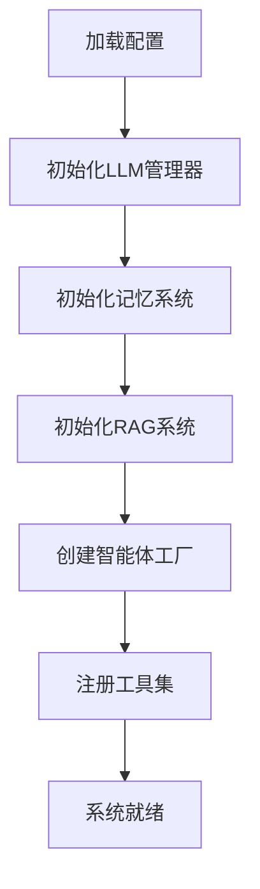
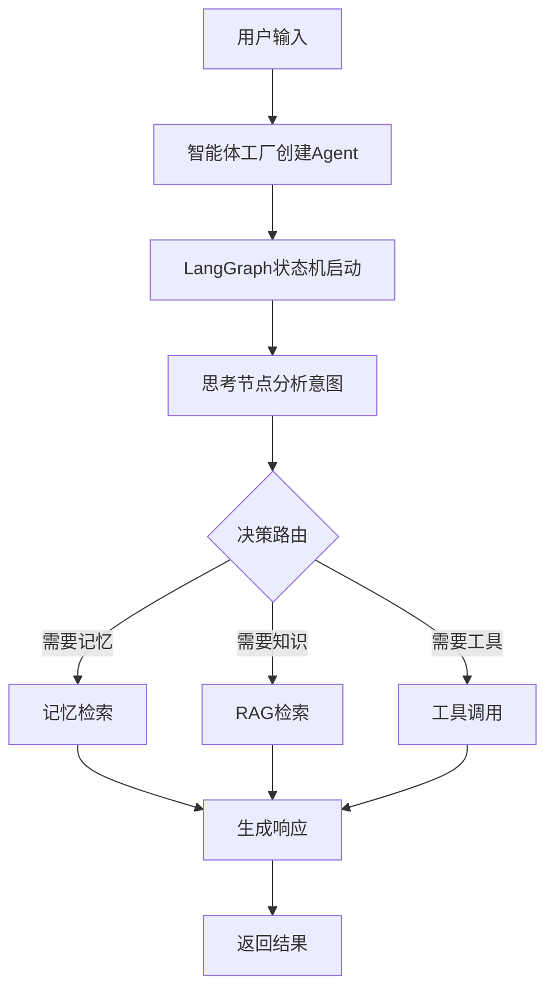

# 🤖 PeerPortal AI Agent 系统项目结构

## 📁 总体项目结构

```
backend/app/agents/
├── 📄 AGENTS_V2_重组完成报告.md          # v2.0 重组完成报告
└── 📁 v2/                                 # v2.0 智能体系统核心目录
    ├── 📄 __init__.py                     # 统一导出接口
    ├── 📄 config.py                       # 配置管理系统
    ├── 📄 CONFIGURATION_GUIDE.md          # 配置指南
    ├── 📄 MIGRATION_GUIDE.md              # 迁移指南
    │
    ├── 📁 ai_foundation/                  # AI基础层
    │   ├── 📁 agents/                     # 智能体工厂
    │   ├── 📁 llm/                        # 大语言模型管理
    │   └── 📁 memory/                     # 记忆系统
    │
    ├── 📁 core_infrastructure/            # 核心基础设施层
    │   ├── 📁 error/                      # 错误处理
    │   ├── 📁 oss/                        # 对象存储
    │   └── 📁 utils/                      # 工具函数
    │
    ├── 📁 data_communication/             # 数据通信层
    │   └── 📁 rag/                        # 检索增强生成
    │
    └── 📁 tools/                          # 工具层
        ├── 📄 __init__.py
        └── 📄 study_tools.py              # 留学专用工具集
```

## 🏗️ 详细架构分层

### 1. 📊 AI Foundation Layer (AI基础层)

```
ai_foundation/
├── agents/
│   └── agent_factory.py              # 智能体工厂 - 动态创建和配置Agent
│
├── llm/
│   ├── manager.py                     # LLM统一管理器
│   └── providers/                     # 模型提供商实现
│       ├── __init__.py
│       ├── base_provider.py          # 抽象基类
│       ├── mock_provider.py          # 模拟提供商
│       └── openai_provider.py        # OpenAI提供商
│
└── memory/
    └── memory_bank.py                 # 双层记忆系统
```

**功能说明**：
- **Agent Factory**: 基于LangGraph的智能体动态创建工厂
- **LLM Manager**: 支持多模型提供商的统一管理接口
- **Memory Bank**: 实现短期记忆(Redis)和长期记忆(Milvus+MongoDB)

### 2. 🔧 Core Infrastructure Layer (核心基础设施层)

```
core_infrastructure/
├── __init__.py
├── error/
│   └── exceptions.py                  # 统一异常处理系统
├── oss/
│   └── storage_manager.py             # 对象存储管理
└── utils/
    └── helpers.py                     # 通用工具函数库
```

**功能说明**：
- **Error Handling**: 15个错误码分类，多语言错误消息
- **Storage Manager**: 阿里云OSS等对象存储服务集成
- **Utilities**: 生成唯一ID、时间戳等通用功能

### 3. 📡 Data Communication Layer (数据通信层)

```
data_communication/
└── rag/
    └── rag_manager.py                 # RAG检索增强生成管理器
```

**功能说明**：
- **RAG Manager**: 支持PDF、Word、Markdown等文档类型
- **混合检索**: 向量搜索 + 关键词搜索
- **智能重排序**: BGE-Reranker模型优化

### 4. 🛠️ Tools Layer (工具层)

```
tools/
├── __init__.py
└── study_tools.py                     # 留学专用工具集
```

**内置工具**：
- `find_mentors_tool`: 查找学长学姐引路人
- `find_services_tool`: 查找留学指导服务
- `web_search_tool`: 实时网络搜索
- `get_platform_stats_tool`: 平台统计数据

## 🎯 智能体类型架构

### Agent Types (智能体类型)

```python
class AgentType(str, Enum):
    STUDY_PLANNER = "study_planner"      # 留学规划师
    ESSAY_REVIEWER = "essay_reviewer"     # 文书润色师  
    INTERVIEW_COACH = "interview_coach"   # 面试指导师
    GENERAL_ADVISOR = "general_advisor"   # 通用咨询师
```

### LangGraph 状态机流程

```
[入口] → 思考节点 → 记忆检索/知识检索/工具调用 → 响应生成 → [结束]
```

**节点类型**：
- **Think Node**: 分析用户意图，决策下一步行动
- **Memory Node**: 检索历史记忆和对话上下文
- **Knowledge Node**: 从RAG系统获取相关知识
- **Tool Node**: 调用外部工具(搜索、数据库查询等)
- **Response Node**: 生成最终回答

## 🔄 系统配置架构

### Configuration System

```python
# config.py - 配置管理系统
V2Config:
    - openai_api_key: str              # OpenAI API密钥
    - redis_url: Optional[str]         # Redis缓存
    - milvus_host: Optional[str]       # 向量数据库
    - mongodb_url: Optional[str]       # 文档数据库
    - elasticsearch_url: Optional[str]  # 搜索引擎
```

### 模型配置

```python
LLM_MODELS = [
    "gpt-4o-mini",      # 默认模型（经济高效）
    "gpt-4",            # 高质量模型  
    "gpt-3.5-turbo"     # 快速响应模型
]

EMBEDDING_MODELS = [
    "text-embedding-ada-002",    # 默认嵌入模型
    "text-embedding-3-small",    # 新版小型模型
    "text-embedding-3-large"     # 新版大型模型
]
```

## 📊 文件统计信息

| 层级 | 文件数量 | 主要功能 |
|-----|---------|----------|
| **AI Foundation** | 6个文件 | LLM管理、记忆系统、智能体工厂 |
| **Core Infrastructure** | 4个文件 | 错误处理、存储管理、工具函数 |
| **Data Communication** | 1个文件 | RAG检索增强生成 |
| **Tools** | 2个文件 | 留学专用工具集 |
| **配置文档** | 4个文件 | 配置指南、迁移指南、完成报告 |
| **总计** | **17个核心文件** | **企业级AI智能体基础设施** |

## 🎭 智能体工作流程

### 1. 初始化流程



### 2. 对话处理流程



## 🚀 部署和扩展

### 最小化部署

```bash
# 仅需OpenAI API Key
OPENAI_API_KEY=sk-proj-xxx
DEBUG=True
```

### 完整部署

```bash
# 包含所有外部服务
OPENAI_API_KEY=sk-proj-xxx
REDIS_URL=redis://localhost:6379
MILVUS_HOST=localhost:19530
MONGODB_URL=mongodb://localhost:27017
ELASTICSEARCH_URL=http://localhost:9200
```

### 扩展能力

- ✅ **新智能体类型**: 通过AgentType枚举添加
- ✅ **新工具集成**: 通过ToolRegistry动态注册
- ✅ **新模型提供商**: 实现BaseProvider接口
- ✅ **新存储后端**: 扩展存储管理器

## 📈 技术优势

### 架构优势
1. **模块化设计**: 清晰的层次分离，松耦合架构
2. **可扩展性**: 支持新智能体、工具、模型的快速集成
3. **企业级特性**: 统一错误处理、多租户支持、使用监控
4. **AI能力**: 双层记忆、混合检索、状态机决策

### 工程优势
1. **代码质量**: 遵循企业级开发标准
2. **文档完整**: 详尽的配置指南和迁移文档
3. **测试覆盖**: 完整的测试和验证机制
4. **部署灵活**: 支持从最小化到完整的渐进式部署

---

**🎊 这是一个世界级的AI智能体基础设施架构！**

_文档版本: v2.0.0_  
_更新时间: 2024年12月_
