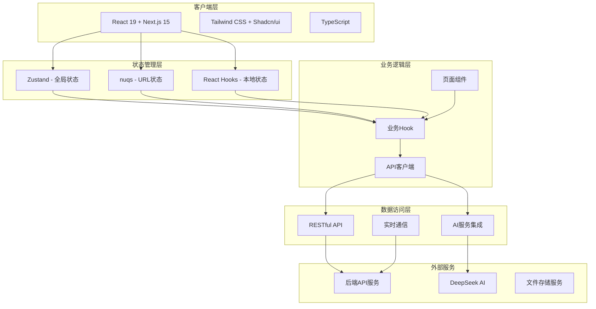

# 🎓 OfferIn 留学平台 - 前端技术设计文档

## 📋 项目概述

- **项目名称**：OfferIn (学长帮) 留学申请平台
- **版本**：v1.0.0
- **创建日期**：2024-12-18
- **最后更新**：2024-12-18
- **文档作者**：开发团队
- **项目类型**：Web应用 - 留学咨询与导师匹配平台

## 🎯 项目背景

OfferIn 是一个专业的留学申请指导平台，致力于连接有留学需求的学生与有经验的学长学姐导师。平台提供智能匹配、AI咨询、申请指导等核心功能，帮助学生更好地完成留学申请过程。

### 核心功能
- 🎯 **智能导师匹配**：基于专业、学校、经验匹配合适的导师
- 🤖 **AI留学助手**：提供24/7智能留学咨询服务
- 💬 **实时聊天系统**：支持学生与导师实时沟通
- 📋 **申请管理**：完整的留学申请流程管理
- 👤 **用户系统**：完善的用户认证和资料管理

### 技术目标
- 🚀 **性能目标**：首屏加载 < 2s，页面切换 < 500ms
- 📱 **响应式设计**：完美适配桌面、平板、手机端
- 🔧 **可维护性**：模块化架构，易于扩展和维护
- 🔒 **安全性**：完善的认证授权机制
- 🌐 **SEO友好**：支持服务端渲染，利于搜索引擎收录

## 🏗️ 技术架构

### 技术栈选择

#### 核心框架
| 技术 | 版本 | 选择理由 | 替代方案 |
|------|------|----------|----------|
| Next.js | 15.5.3 | App Router、SSR/SSG支持、性能优秀 | Remix、Nuxt.js |
| React | 19.1.0 | 最新特性、生态丰富、团队熟悉 | Vue 3、Svelte |
| TypeScript | 5.x | 类型安全、开发效率、代码质量 | JavaScript |

#### 状态管理
| 技术 | 用途 | 选择理由 |
|------|------|----------|
| Zustand | 全局状态管理 | 轻量级、API简洁、TypeScript友好 |
| nuqs | URL状态同步 | 搜索参数状态管理、SEO友好 |
| React Hooks | 本地状态管理 | 原生支持、性能优秀 |

#### UI框架和样式
| 技术 | 用途 | 选择理由 |
|------|------|----------|
| Tailwind CSS | 样式系统 | v4版本、原子化CSS、高度可定制 |
| Shadcn/ui | 基础组件库 | 可定制、现代化设计、TypeScript |
| Lucide React | 图标库 | 轻量级、一致性设计 |
| CVA | 组件变体管理 | 类型安全的样式变体 |

#### AI集成
| 技术 | 用途 | 选择理由 |
|------|------|----------|
| AI SDK | AI服务集成 | 多提供商支持、流式响应 |
| DeepSeek API | 对话AI模型 | 中文支持优秀、成本效益高 |
| React Markdown | Markdown渲染 | 支持AI回复的富文本显示 |

### 系统架构图



## 📁 目录结构设计

### 整体结构
```
app/
├── _components/              # 可复用组件
│   ├── auth/                # 认证相关组件
│   │   ├── auth-header.tsx
│   │   └── auth-initializer.tsx
│   ├── base/                # 基础布局组件
│   │   ├── navbar.tsx
│   │   ├── footer.tsx
│   │   └── logo.tsx
│   ├── first-visit/         # 首次访问流程
│   │   ├── first-visit-modal.tsx
│   │   ├── user-type-selection.tsx
│   │   └── study-info-form.tsx
│   ├── modal/               # 模态框组件
│   │   └── filter-modal.tsx
│   ├── profile/             # 用户资料组件
│   │   ├── clickable-avatar.tsx
│   │   └── edit-profile-dialog.tsx
│   └── ui/                  # Shadcn UI 基础组件
│       ├── button.tsx
│       ├── input.tsx
│       ├── dialog.tsx
│       └── ...
├── _data/                   # 静态数据
│   └── tutors.json
├── _hooks/                  # 自定义Hook
│   ├── use-auth.ts
│   ├── use-first-visit.ts
│   └── use-file-upload.ts
├── _lib/                    # 工具库和API
│   ├── api.ts               # API客户端
│   ├── api-config.ts        # API配置
│   ├── auth.ts              # 认证工具
│   └── utils.ts             # 通用工具
├── _store/                  # 状态管理
│   └── auth-store.ts        # 认证状态
├── (homepage)/              # 首页路由组
│   ├── (auth)/              # 认证页面
│   │   ├── login/
│   │   └── signup/
│   └── page.tsx
├── ai-advisor/              # AI顾问页面
│   └── page.tsx
├── api/                     # API路由
│   ├── chat/
│   │   └── route.ts
│   └── proxy/
├── chat/                    # 聊天页面
│   └── page.tsx
├── profile/                 # 用户资料页面
│   └── page.tsx
├── tutor/                   # 导师相关页面
│   ├── [id]/
│   │   └── page.tsx
│   └── page.tsx
├── globals.css              # 全局样式
└── layout.tsx               # 根布局
```

### 组件分类和设计

#### 1. 基础UI组件 (ui/)
遵循Shadcn/ui设计系统，提供一致的基础组件。

```typescript
// Button组件示例
interface ButtonProps {
  variant?: 'default' | 'destructive' | 'outline' | 'secondary' | 'ghost' | 'link';
  size?: 'default' | 'sm' | 'lg' | 'icon';
  asChild?: boolean;
  className?: string;
  children: React.ReactNode;
}

export const Button = React.forwardRef<HTMLButtonElement, ButtonProps>(
  ({ className, variant = "default", size = "default", asChild = false, ...props }, ref) => {
    // 组件实现
  }
);
```

#### 2. 业务组件 (business/)
针对业务场景的复合组件。

```typescript
// SearchField组件
interface SearchFieldProps {
  initialValue?: string;
  onSearch?: (value: string) => void;
  showSuggestions?: boolean;
  placeholder?: string;
}

export default function SearchField({
  initialValue = '',
  onSearch,
  showSuggestions = true,
  placeholder = '搜索专业或大学...'
}: SearchFieldProps) {
  // 智能搜索逻辑
  // 建议显示逻辑
  // URL状态同步
}
```

#### 3. 布局组件 (layout/)
页面布局和导航组件。

```typescript
// Navbar组件
interface NavbarProps {
  className?: string;
}

export default function Navbar({ className }: NavbarProps) {
  const { user, isAuthenticated, logout } = useAuthStore();
  
  // 响应式导航
  // 用户状态显示
  // 移动端适配
}
```

## 🔄 状态管理设计

### 状态分层架构

#### 1. 全局状态 (Zustand)
用于跨组件共享的关键状态。

```typescript
// 认证状态管理
interface AuthState {
  // 状态
  user: User | null;
  token: string | null;
  loading: boolean;
  isAuthenticated: boolean;
  initialized: boolean;

  // 操作
  login: (credentials: LoginRequest) => Promise<void>;
  register: (userData: RegisterRequest) => Promise<void>;
  logout: () => void;
  initializeAuth: () => Promise<void>;
  refreshToken: () => Promise<void>;
}

export const useAuthStore = create<AuthState>()(
  persist(
    (set, get) => ({
      // 状态实现
      user: null,
      token: null,
      loading: true,
      isAuthenticated: false,
      initialized: false,
      
      // 操作实现
      login: async (credentials) => {
        // 登录逻辑
      },
      // ... 其他操作
    }),
    {
      name: 'auth-storage',
      partialize: (state) => ({
        user: state.user,
        token: state.token,
        isAuthenticated: state.isAuthenticated
      })
    }
  )
);
```

#### 2. URL状态同步 (nuqs)
用于搜索、筛选等需要URL同步的状态。

```typescript
// 导师搜索页面状态
function TutorSearchContent() {
  const [searchTerm, setSearchTerm] = useQueryState('q', {
    defaultValue: ''
  });
  
  const [selectedMajors, setSelectedMajors] = useQueryState('majors', {
    defaultValue: [] as string[],
    serialize: value => value.length > 0 ? value.join(',') : '',
    parse: value => value ? value.split(',').filter(Boolean) : []
  });
  
  const [priceRange, setPriceRange] = useQueryState('price', {
    defaultValue: [0, 300] as [number, number],
    serialize: value => `${value[0]}-${value[1]}`,
    parse: value => {
      if (!value) return [0, 300] as [number, number];
      const [min, max] = value.split('-').map(Number);
      return [min || 0, max || 300] as [number, number];
    }
  });
  
  // 使用状态进行筛选和搜索
}
```

#### 3. 本地状态 (React Hooks)
用于组件内部的状态管理。

```typescript
// ChatWidget组件状态
export default function ChatWidget() {
  const [isOpen, setIsOpen] = useState(false);
  const [input, setInput] = useState('');
  const [isLoading, setIsLoading] = useState(false);
  const [messages, setMessages] = useState<UIMessage[]>(initialMessages);
  
  // 消息发送逻辑
  const sendMessage = async (messageText: string) => {
    if (!messageText.trim() || isLoading) return;
    
    setIsLoading(true);
    try {
      // AI对话逻辑
    } finally {
      setIsLoading(false);
    }
  };
}
```

## 🌐 API集成设计

### API客户端架构

#### 1. 统一配置管理
```typescript
// api-config.ts
export const API_CONFIG = {
  BASE_URL: process.env.NEXT_PUBLIC_API_BASE_URL || '/api',
  ENDPOINTS: {
    AUTH: {
      LOGIN: '/api/v1/auth/login',
      REGISTER: '/api/v1/auth/register',
      REFRESH: '/api/v1/auth/refresh',
    },
    USERS: {
      ME: '/api/v1/users/me',
      UPDATE: '/api/v1/users/me',
    },
    AI_AGENTS_V2: {
      PLANNER_CHAT: '/api/v2/agents/planner/chat',
      CONSULTANT_CHAT: '/api/v2/agents/consultant/chat',
    },
    MENTORS: {
      SEARCH: '/api/v1/mentors/search',
      PROFILE: '/api/v1/mentors/profile',
    }
  }
} as const;
```

#### 2. API客户端实现
```typescript
// api.ts
class ApiClient {
  private baseUrl: string;

  constructor(baseUrl: string = API_CONFIG.BASE_URL) {
    this.baseUrl = baseUrl;
  }

  // 登录接口
  async login(credentials: LoginRequest): Promise<LoginResponse> {
    const formData = new FormData();
    formData.append('username', credentials.username);
    formData.append('password', credentials.password);

    const response = await fetch(
      `${this.baseUrl}${API_CONFIG.ENDPOINTS.AUTH.LOGIN}`,
      {
        method: 'POST',
        body: formData
      }
    );

    if (!response.ok) {
      const error: ApiError = await response.json();
      throw new Error(error.detail || 'Login failed');
    }

    return response.json();
  }

  // AI聊天接口
  async sendChatMessage(
    message: string,
    sessionId?: string
  ): Promise<Response> {
    const response = await fetch(
      `${this.baseUrl}${API_CONFIG.ENDPOINTS.PLANNER.INVOKE}`,
      {
        method: 'POST',
        headers: {
          'Content-Type': 'application/json'
        },
        body: JSON.stringify({
          input: message,
          session_id: sessionId,
          stream: true
        })
      }
    );

    if (!response.ok) {
      throw new Error('Failed to send chat message');
    }

    return response;
  }
}

export const apiClient = new ApiClient();
```

#### 3. 自动token刷新机制
```typescript
// api请求包装器，支持自动token刷新
const apiRequest = async (
  url: string,
  options: RequestInit = {}
): Promise<Response> => {
  const token = getAuthToken();

  const headers = {
    'Content-Type': 'application/json',
    ...options.headers,
    ...(token && { Authorization: `Bearer ${token}` })
  };

  const response = await fetch(url, {
    ...options,
    headers
  });

  // Token过期时自动刷新
  if (response.status === 401 && token) {
    try {
      const refreshResponse = await fetch(
        getFullUrl(API_CONFIG.ENDPOINTS.AUTH.REFRESH),
        {
          method: 'POST',
          headers: {
            Authorization: `Bearer ${token}`
          }
        }
      );

      if (refreshResponse.ok) {
        const refreshData = await refreshResponse.json();
        const newToken = refreshData.data.access_token;
        
        // 更新token并重试请求
        updateStoredToken(newToken);
        
        return fetch(url, {
          ...options,
          headers: {
            ...headers,
            Authorization: `Bearer ${newToken}`
          }
        });
      }
    } catch (refreshError) {
      console.warn('Token refresh failed:', refreshError);
    }
  }

  return response;
};
```

### AI服务集成

#### 1. 流式响应处理
```typescript
// AI聊天流式响应处理
const sendMessage = async (messageText: string) => {
  const response = await fetch('/api/chat', {
    method: 'POST',
    headers: { 'Content-Type': 'application/json' },
    body: JSON.stringify({
      messages: [...messages, userMessage]
    })
  });

  const reader = response.body?.getReader();
  const decoder = new TextDecoder();
  let done = false;
  let assistantMessageContent = '';

  while (!done) {
    const { value, done: doneReading } = await reader.read();
    done = doneReading;

    if (value) {
      const chunk = decoder.decode(value, { stream: true });
      assistantMessageContent += chunk;
      
      // 实时更新UI显示
      setMessages(prev => {
        const newMessages = [...prev];
        newMessages[newMessages.length - 1] = {
          ...newMessages[newMessages.length - 1],
          parts: [{ type: 'text', text: assistantMessageContent }]
        };
        return newMessages;
      });
    }
  }
};
```

#### 2. AI API路由实现
```typescript
// app/api/chat/route.ts
import { streamText } from 'ai';
import { createDeepSeek } from '@ai-sdk/deepseek';

const deepseek = createDeepSeek({
  apiKey: process.env.DEEPSEEK_API_KEY ?? '',
  baseURL: 'https://api.deepseek.com/v1'
});

export async function POST(req: Request) {
  try {
    const { messages } = await req.json();

    const result = await streamText({
      model: deepseek('deepseek-chat'),
      messages: messages,
      system: `您是学长帮 AI 留学规划师，一个专业的留学咨询助手。
      
您的职责是：
• 🎯 推荐适合的学校和专业
• 📋 查询申请要求和截止日期
• 👥 匹配合适的学长学姐引路人
• 🛍️ 推荐相关指导服务
• 📅 制定申请时间规划
• 💡 提供文书和面试建议`
    });

    return result.toTextStreamResponse();
  } catch (error) {
    return new Response(
      JSON.stringify({ error: 'Failed to process chat request' }),
      { status: 500 }
    );
  }
}
```

## 🎨 用户体验设计

### 响应式设计策略

#### 1. 断点系统
```typescript
// Tailwind CSS 断点配置
const breakpoints = {
  'sm': '640px',   // 手机横屏
  'md': '768px',   // 平板
  'lg': '1024px',  // 笔记本
  'xl': '1280px',  // 桌面
  '2xl': '1536px'  // 大屏幕
};

// 响应式组件示例
<div className="
  grid grid-cols-1 gap-4
  md:grid-cols-2 md:gap-6
  lg:grid-cols-3 lg:gap-8
">
  {/* 导师卡片 */}
</div>
```

#### 2. 移动端优化
```typescript
// 移动端导航菜单
export default function MobileMenu() {
  const [isOpen, setIsOpen] = useState(false);
  
  return (
    <>
      {/* 汉堡菜单按钮 */}
      <Button
        className="group size-8 md:hidden"
        variant="ghost"
        size="icon"
        onClick={() => setIsOpen(!isOpen)}
      >
        {/* 动画汉堡图标 */}
      </Button>
      
      {/* 移动端菜单 */}
      <Popover open={isOpen} onOpenChange={setIsOpen}>
        <PopoverContent align="start" className="w-36 p-1 md:hidden">
          <NavigationMenu className="max-w-none *:w-full">
            <NavigationMenuList className="flex-col items-start gap-0">
              {navigationLinks.map((link, index) => (
                <NavigationMenuItem key={index} className="w-full">
                  <NavigationMenuLink href={link.href}>
                    {link.label}
                  </NavigationMenuLink>
                </NavigationMenuItem>
              ))}
            </NavigationMenuList>
          </NavigationMenu>
        </PopoverContent>
      </Popover>
    </>
  );
}
```

### 交互体验优化

#### 1. 加载状态管理
```typescript
// 骨架屏组件
export function TutorCardSkeleton() {
  return (
    <div className="border rounded-lg p-6 animate-pulse">
      <div className="flex items-start gap-4 mb-4">
        <div className="w-16 h-16 bg-muted rounded-full" />
        <div className="flex-1 space-y-2">
          <div className="h-4 bg-muted rounded w-3/4" />
          <div className="h-3 bg-muted rounded w-1/2" />
        </div>
      </div>
      {/* 更多骨架元素 */}
    </div>
  );
}

// 使用Suspense进行代码分割
export default function TutorSearch() {
  return (
    <Suspense fallback={<TutorSearchSkeleton />}>
      <TutorSearchContent />
    </Suspense>
  );
}
```

#### 2. 错误处理和用户反馈
```typescript
// 错误边界组件
export function ErrorBoundary({ children }: { children: React.ReactNode }) {
  return (
    <ErrorBoundaryProvider
      fallback={({ error, reset }) => (
        <div className="flex flex-col items-center justify-center min-h-[400px] p-8">
          <div className="text-center">
            <h2 className="text-lg font-semibold mb-2">出现了一些问题</h2>
            <p className="text-muted-foreground mb-4">
              {error.message || '页面加载失败，请稍后重试'}
            </p>
            <Button onClick={reset}>重新加载</Button>
          </div>
        </div>
      )}
    >
      {children}
    </ErrorBoundaryProvider>
  );
}
```

## 🚀 性能优化策略

### 代码分割和懒加载

#### 1. 路由级别分割
```typescript
// 动态导入页面组件
const TutorDetailPage = dynamic(() => import('./tutor/[id]/page'), {
  loading: () => <PageSkeleton />,
  ssr: true // 支持SSR
});

const ChatPage = dynamic(() => import('./chat/page'), {
  loading: () => <ChatSkeleton />,
  ssr: false // 纯客户端组件
});
```

#### 2. 组件级别分割
```typescript
// 按需加载重型组件
const ChatWidget = dynamic(() => import('@/components/ui/chat-widget'), {
  loading: () => <div className="fixed bottom-4 right-4 w-14 h-14 bg-muted rounded-full animate-pulse" />,
  ssr: false
});

// 条件加载
function HomePage() {
  const [showChart, setShowChart] = useState(false);
  
  const ChartComponent = useMemo(() => 
    showChart ? dynamic(() => import('./Chart')) : null,
    [showChart]
  );
  
  return (
    <div>
      <button onClick={() => setShowChart(true)}>显示图表</button>
      {ChartComponent && <ChartComponent />}
    </div>
  );
}
```

### 图片和资源优化

#### 1. Next.js Image组件优化
```typescript
// 响应式图片
<Image
  src="/hero-background.jpg"
  alt="留学申请场景"
  fill
  className="object-cover"
  priority
  sizes="(max-width: 768px) 100vw, (max-width: 1200px) 50vw, 33vw"
  placeholder="blur"
  blurDataURL="data:image/jpeg;base64,/9j/4AAQSkZJRgABAQAAAQ..."
/>

// 用户头像优化
<Image
  src={user.avatarUrl || '/default-avatar.png'}
  alt={user.name}
  width={64}
  height={64}
  className="rounded-full"
  loading="lazy"
/>
```

#### 2. 字体优化
```typescript
// app/layout.tsx
import { Geist, Geist_Mono } from 'next/font/google';

const geistSans = Geist({
  variable: '--font-geist-sans',
  subsets: ['latin'],
  display: 'swap', // 字体交换策略
  preload: true
});

const geistMono = Geist_Mono({
  variable: '--font-geist-mono',
  subsets: ['latin'],
  display: 'swap'
});
```

### 缓存策略

#### 1. 客户端缓存
```typescript
// API响应缓存
const cache = new Map();

async function fetchWithCache<T>(key: string, fetcher: () => Promise<T>, ttl = 60000): Promise<T> {
  const cached = cache.get(key);
  
  if (cached && Date.now() - cached.timestamp < ttl) {
    return cached.data;
  }
  
  const data = await fetcher();
  cache.set(key, { data, timestamp: Date.now() });
  
  return data;
}

// 使用示例
const tutors = await fetchWithCache(
  `tutors-${searchTerm}`,
  () => apiClient.searchTutors({ search_query: searchTerm }),
  300000 // 5分钟缓存
);
```

#### 2. 浏览器缓存配置
```typescript
// next.config.ts
const nextConfig: NextConfig = {
  async headers() {
    return [
      {
        source: '/static/:path*',
        headers: [
          {
            key: 'Cache-Control',
            value: 'public, max-age=31536000, immutable',
          },
        ],
      },
      {
        source: '/api/:path*',
        headers: [
          {
            key: 'Cache-Control',
            value: 'public, max-age=60, stale-while-revalidate=300',
          },
        ],
      },
    ];
  },
};
```

## 🧪 测试策略

### 测试分层架构

#### 1. 单元测试
```typescript
// components/ui/Button.test.tsx
import { render, screen, fireEvent } from '@testing-library/react';
import { Button } from './Button';

describe('Button Component', () => {
  test('renders with correct text', () => {
    render(<Button>点击我</Button>);
    expect(screen.getByText('点击我')).toBeInTheDocument();
  });
  
  test('calls onClick when clicked', () => {
    const handleClick = jest.fn();
    render(<Button onClick={handleClick}>点击我</Button>);
    
    fireEvent.click(screen.getByText('点击我'));
    expect(handleClick).toHaveBeenCalledTimes(1);
  });
  
  test('applies correct variant styles', () => {
    render(<Button variant="destructive">删除</Button>);
    const button = screen.getByText('删除');
    expect(button).toHaveClass('bg-destructive');
  });
});
```

#### 2. 集成测试
```typescript
// pages/tutor/TutorSearch.test.tsx
import { render, screen, fireEvent, waitFor } from '@testing-library/react';
import { TutorSearchContent } from './TutorSearchContent';

// Mock API
jest.mock('@/lib/api', () => ({
  apiClient: {
    searchTutors: jest.fn(() => Promise.resolve(mockTutors))
  }
}));

describe('Tutor Search Page', () => {
  test('searches and displays results', async () => {
    render(<TutorSearchContent />);
    
    const searchInput = screen.getByPlaceholderText('搜索专业或大学...');
    fireEvent.change(searchInput, { target: { value: '计算机科学' } });
    fireEvent.keyDown(searchInput, { key: 'Enter' });
    
    await waitFor(() => {
      expect(screen.getByText('找到 3 位导师')).toBeInTheDocument();
    });
    
    expect(screen.getByText('张三')).toBeInTheDocument();
    expect(screen.getByText('李四')).toBeInTheDocument();
  });
  
  test('filters tutors by major', async () => {
    render(<TutorSearchContent />);
    
    const majorFilter = screen.getByText('计算机科学');
    fireEvent.click(majorFilter);
    
    await waitFor(() => {
      expect(screen.getByText('找到 2 位导师')).toBeInTheDocument();
    });
  });
});
```

#### 3. E2E测试
```typescript
// e2e/tutor-booking.spec.ts
import { test, expect } from '@playwright/test';

test('用户可以成功预约导师', async ({ page }) => {
  // 登录
  await page.goto('/login');
  await page.fill('[data-testid=username]', 'testuser');
  await page.fill('[data-testid=password]', 'password123');
  await page.click('[data-testid=login-button]');
  
  // 搜索导师
  await page.goto('/tutor');
  await page.fill('[placeholder="搜索专业或大学..."]', '计算机科学');
  await page.press('[placeholder="搜索专业或大学..."]', 'Enter');
  
  // 选择导师
  await page.click('text=张三');
  await expect(page).toHaveURL('/tutor/1');
  
  // 预约导师
  await page.click('text=立即预约');
  await page.fill('[data-testid=message]', '希望咨询留学申请事宜');
  await page.click('[data-testid=confirm-booking]');
  
  // 验证预约成功
  await expect(page.locator('text=预约成功')).toBeVisible();
});
```

### 测试工具配置

#### 1. Jest配置
```javascript
// jest.config.js
const nextJest = require('next/jest');

const createJestConfig = nextJest({
  dir: './',
});

const customJestConfig = {
  setupFilesAfterEnv: ['<rootDir>/jest.setup.js'],
  moduleNameMapping: {
    '^@/components/(.*)$': '<rootDir>/app/_components/$1',
    '^@/lib/(.*)$': '<rootDir>/app/_lib/$1',
    '^@/hooks/(.*)$': '<rootDir>/app/_hooks/$1',
    '^@/store/(.*)$': '<rootDir>/app/_store/$1',
  },
  testEnvironment: 'jest-environment-jsdom',
  collectCoverageFrom: [
    'app/_components/**/*.{ts,tsx}',
    'app/_hooks/**/*.{ts,tsx}',
    'app/_lib/**/*.{ts,tsx}',
    '!**/*.d.ts',
    '!**/*.stories.{ts,tsx}',
  ],
  coverageThreshold: {
    global: {
      branches: 70,
      functions: 70,
      lines: 70,
      statements: 70,
    },
  },
};

module.exports = createJestConfig(customJestConfig);
```

#### 2. 测试脚本
```json
{
  "scripts": {
    "test": "jest",
    "test:watch": "jest --watch",
    "test:coverage": "jest --coverage",
    "test:e2e": "playwright test",
    "test:e2e:ui": "playwright test --ui"
  }
}
```

## 🚀 部署和运维

### 构建配置

#### 1. 生产构建优化
```typescript
// next.config.ts
const nextConfig: NextConfig = {
  // 图片优化
  images: {
    domains: ['example.com', 'web-4w0h.onrender.com', 'localhost'],
    remotePatterns: [
      {
        protocol: 'https',
        hostname: '**'
      }
    ]
  },
  
  // 压缩配置
  compress: true,
  
  // 实验性功能
  experimental: {
    optimizePackageImports: ['lucide-react', '@radix-ui/react-icons'],
  },
  
  // 构建优化
  webpack: (config, { dev, isServer }) => {
    if (!dev && !isServer) {
      config.resolve.alias = {
        ...config.resolve.alias,
        '@/components': path.resolve(__dirname, 'app/_components'),
      };
    }
    return config;
  },
};
```

#### 2. 环境变量管理
```bash
# .env.local (生产环境)
NEXT_PUBLIC_API_BASE_URL=https://api.offerin.com
NEXT_PUBLIC_APP_ENV=production
DEEPSEEK_API_KEY=sk-xxx
NEXT_PUBLIC_ANALYTICS_ID=GA_MEASUREMENT_ID

# .env.development (开发环境)
NEXT_PUBLIC_API_BASE_URL=http://localhost:8000
NEXT_PUBLIC_APP_ENV=development
DEEPSEEK_API_KEY=sk-dev-xxx
```

### 部署策略

#### 1. Vercel部署配置
```json
// vercel.json
{
  "framework": "nextjs",
  "buildCommand": "npm run build",
  "devCommand": "npm run dev",
  "installCommand": "npm install",
  "functions": {
    "app/api/**/*.ts": {
      "maxDuration": 30
    }
  },
  "headers": [
    {
      "source": "/api/(.*)",
      "headers": [
        {
          "key": "Access-Control-Allow-Origin",
          "value": "*"
        },
        {
          "key": "Access-Control-Allow-Methods",
          "value": "GET, POST, PUT, DELETE, OPTIONS"
        },
        {
          "key": "Access-Control-Allow-Headers",
          "value": "Content-Type, Authorization"
        }
      ]
    }
  ],
  "rewrites": [
    {
      "source": "/api/:path*",
      "destination": "https://api.offerin.com/:path*"
    }
  ]
}
```

#### 2. Docker部署配置
```dockerfile
# Dockerfile
FROM node:18-alpine AS base

# 安装依赖
FROM base AS deps
RUN apk add --no-cache libc6-compat
WORKDIR /app
COPY package.json package-lock.json ./
RUN npm ci --only=production

# 构建应用
FROM base AS builder
WORKDIR /app
COPY --from=deps /app/node_modules ./node_modules
COPY . .

ENV NEXT_TELEMETRY_DISABLED 1
RUN npm run build

# 运行时
FROM base AS runner
WORKDIR /app

ENV NODE_ENV production
ENV NEXT_TELEMETRY_DISABLED 1

RUN addgroup --system --gid 1001 nodejs
RUN adduser --system --uid 1001 nextjs

COPY --from=builder /app/public ./public
COPY --from=builder --chown=nextjs:nodejs /app/.next/standalone ./
COPY --from=builder --chown=nextjs:nodejs /app/.next/static ./.next/static

USER nextjs

EXPOSE 3000

ENV PORT 3000

CMD ["node", "server.js"]
```

### 监控和分析

#### 1. 性能监控
```typescript
// app/layout.tsx
export function reportWebVitals(metric: NextWebVitalsMetric) {
  if (metric.label === 'web-vital') {
    // 发送到分析服务
    gtag('event', metric.name, {
      custom_parameter_1: metric.value,
      custom_parameter_2: metric.id,
      custom_parameter_3: metric.label,
    });
    
    // 发送到自定义分析
    analytics.track('Web Vitals', {
      name: metric.name,
      value: metric.value,
      id: metric.id,
      label: metric.label,
    });
  }
}
```

#### 2. 错误追踪
```typescript
// lib/error-reporting.ts
export class ErrorReporting {
  static captureException(error: Error, context?: any) {
    // 发送到错误追踪服务
    if (process.env.NODE_ENV === 'production') {
      console.error('Error captured:', error, context);
      
      // 可以集成 Sentry, LogRocket 等服务
      // Sentry.captureException(error, { contexts: context });
    }
  }
  
  static captureMessage(message: string, level: 'info' | 'warning' | 'error' = 'info') {
    if (process.env.NODE_ENV === 'production') {
      console[level]('Message captured:', message);
      
      // Sentry.captureMessage(message, level);
    }
  }
}
```

## 📊 性能基准和指标

### 性能目标

| 指标 | 目标值 | 测量方法 |
|------|--------|----------|
| 首屏加载时间 (LCP) | < 2.5s | Lighthouse, Web Vitals |
| 首次输入延迟 (FID) | < 100ms | Real User Monitoring |
| 累积布局偏移 (CLS) | < 0.1 | Web Vitals API |
| 页面切换时间 | < 500ms | 自定义性能追踪 |
| API响应时间 | < 200ms | API监控 |

### 监控实现

```typescript
// 性能监控Hook
export function usePerformanceMonitoring() {
  useEffect(() => {
    // 监控页面加载性能
    const observer = new PerformanceObserver((list) => {
      list.getEntries().forEach((entry) => {
        if (entry.entryType === 'navigation') {
          const navigationEntry = entry as PerformanceNavigationTiming;
          
          const metrics = {
            dns: navigationEntry.domainLookupEnd - navigationEntry.domainLookupStart,
            tcp: navigationEntry.connectEnd - navigationEntry.connectStart,
            request: navigationEntry.responseStart - navigationEntry.requestStart,
            response: navigationEntry.responseEnd - navigationEntry.responseStart,
            dom: navigationEntry.domContentLoadedEventEnd - navigationEntry.responseEnd,
            load: navigationEntry.loadEventEnd - navigationEntry.loadEventStart,
          };
          
          console.log('Navigation metrics:', metrics);
        }
      });
    });
    
    observer.observe({ entryTypes: ['navigation'] });
    
    return () => observer.disconnect();
  }, []);
}
```

## 📚 开发规范和最佳实践

### 代码规范

#### 1. 命名规范
```typescript
// 组件命名 - PascalCase
export function SearchField() {}
export function TutorCard() {}

// Hook命名 - camelCase with use prefix
export function useAuth() {}
export function useFirstVisit() {}

// 常量命名 - UPPER_SNAKE_CASE
export const API_BASE_URL = 'https://api.example.com';
export const MAX_UPLOAD_SIZE = 5 * 1024 * 1024; // 5MB

// 类型命名 - PascalCase
export interface UserProfile {}
export type SearchFilters = {};
```

#### 2. 文件组织规范
```
// 组件文件结构
SearchField/
├── index.ts          # 导出文件
├── SearchField.tsx   # 主组件
├── SearchField.test.tsx # 测试文件
├── SearchField.stories.tsx # Storybook故事
└── types.ts          # 类型定义
```

#### 3. 导入顺序规范
```typescript
// 1. React和Next.js
import React from 'react';
import { useState, useEffect } from 'react';
import Link from 'next/link';
import { useRouter } from 'next/navigation';

// 2. 第三方库
import { clsx } from 'clsx';
import { Loader2 } from 'lucide-react';

// 3. 内部组件和工具
import { Button } from '@/components/ui/button';
import { useAuthStore } from '@/store/auth-store';
import { apiClient } from '@/lib/api';

// 4. 类型导入
import type { User, SearchFilters } from '@/types';
```

### Git工作流规范

#### 1. 分支命名
```bash
# 功能分支
feature/user-authentication
feature/ai-chat-integration
feature/tutor-search-filters

# 修复分支
fix/login-redirect-issue
fix/mobile-menu-overflow

# 发布分支
release/v1.1.0

# 热修复分支
hotfix/critical-security-patch
```

#### 2. 提交信息规范
```bash
# 功能提交
feat: add AI chat widget to homepage
feat(auth): implement JWT token refresh mechanism

# 修复提交
fix: resolve mobile menu overflow issue
fix(api): handle network timeout errors

# 文档提交
docs: update API integration guide
docs(readme): add deployment instructions

# 样式提交
style: improve tutor card responsive design
style(ui): update button hover states

# 重构提交
refactor: extract search logic into custom hook
refactor(api): simplify error handling logic

# 测试提交
test: add unit tests for SearchField component
test(e2e): add tutor booking flow tests
```

## 🔄 版本控制和更新计划

### 版本历史

| 版本 | 发布日期 | 主要变更 |
|------|----------|----------|
| v1.0.0 | 2024-12-18 | 初始版本，包含核心功能 |
| v1.1.0 | 计划中 | AI助手功能增强，性能优化 |
| v1.2.0 | 计划中 | 移动端体验优化，新增筛选功能 |

### 技术债务和改进计划

#### 短期目标 (1-3个月)
- [ ] 完善单元测试覆盖率至80%以上
- [ ] 实现完整的E2E测试套件
- [ ] 优化首屏加载性能至2s以内
- [ ] 添加更多AI对话场景

#### 中期目标 (3-6个月)
- [ ] 实现PWA功能，支持离线使用
- [ ] 集成实时通知系统
- [ ] 添加多语言支持
- [ ] 实现高级搜索和推荐算法

#### 长期目标 (6-12个月)
- [ ] 微前端架构重构
- [ ] 实现完整的设计系统
- [ ] 性能监控和分析平台
- [ ] 自动化CI/CD流水线优化

---

## 📞 联系和支持

### 技术支持
- **文档维护**：开发团队
- **技术咨询**：architecture@offerin.com
- **问题反馈**：issues@offerin.com

### 相关资源
- [项目仓库](https://github.com/offerin/frontend)
- [设计系统文档](./design-system.md)
- [API接口文档](./API文档.md)
- [部署指南](./deployment-guide.md)

---

💡 **提示**：本文档会随着项目发展持续更新，建议开发团队定期review和更新相关内容。如有任何技术问题或改进建议，欢迎提交Issue或Pull Request。

