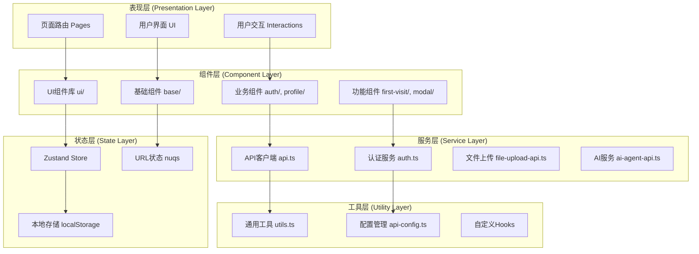
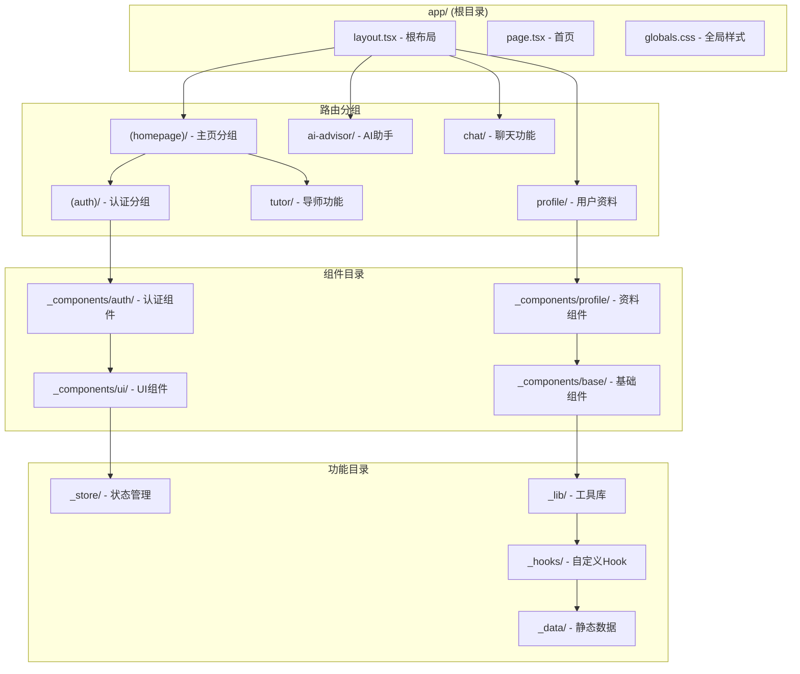
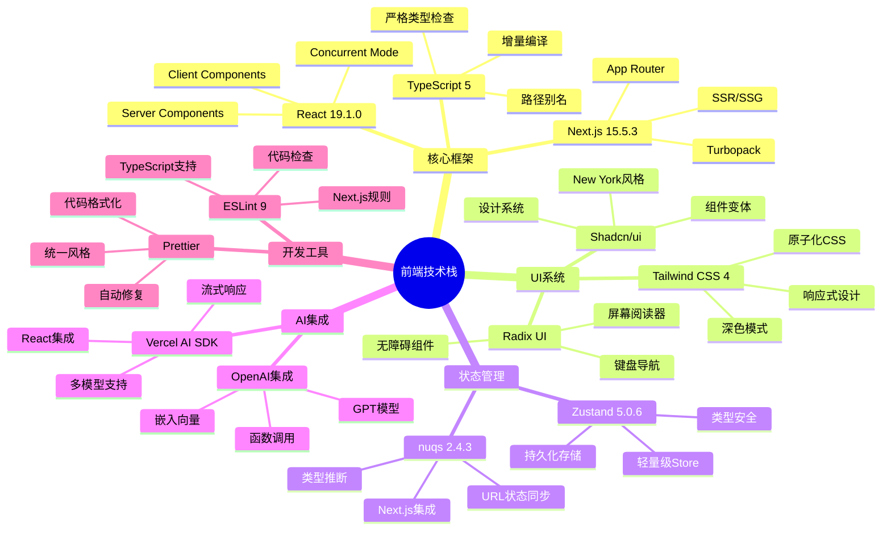
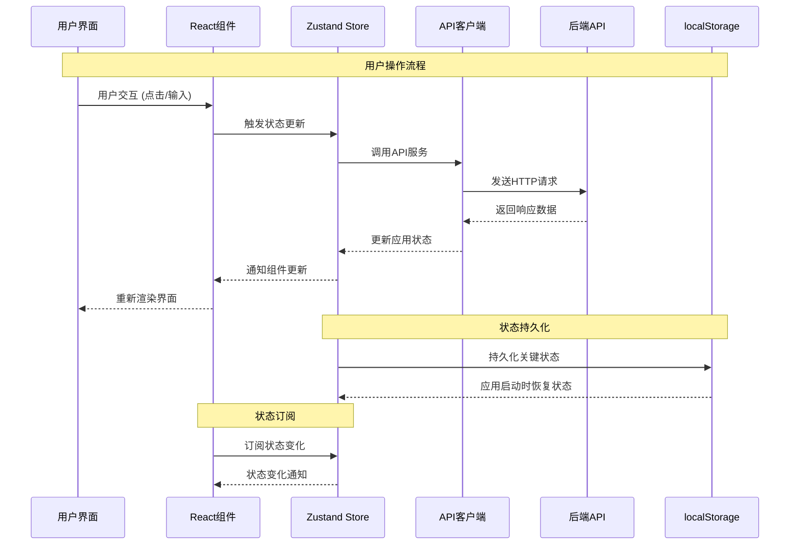
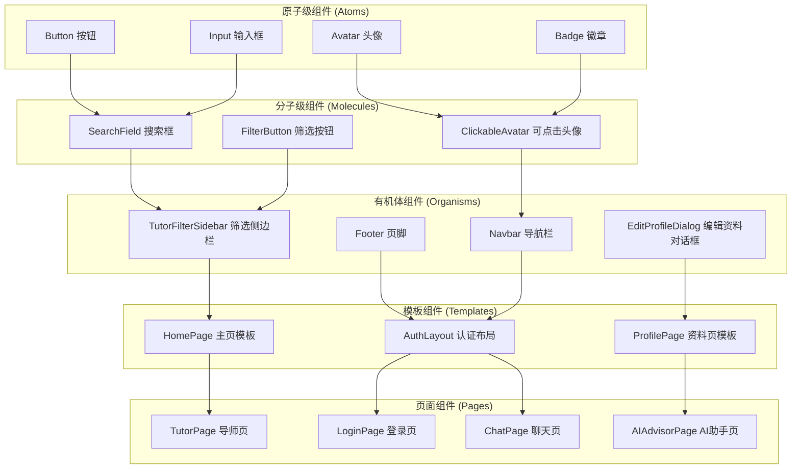
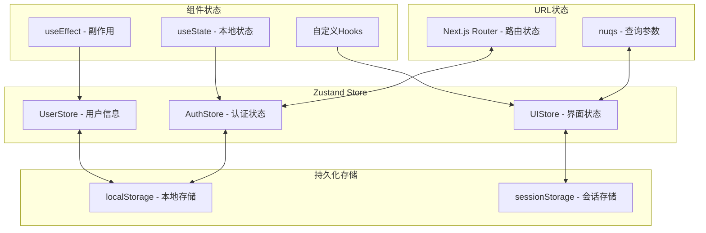
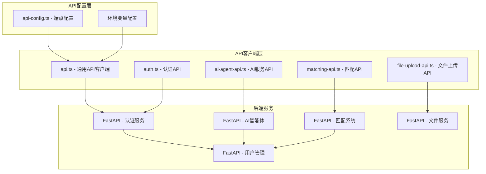
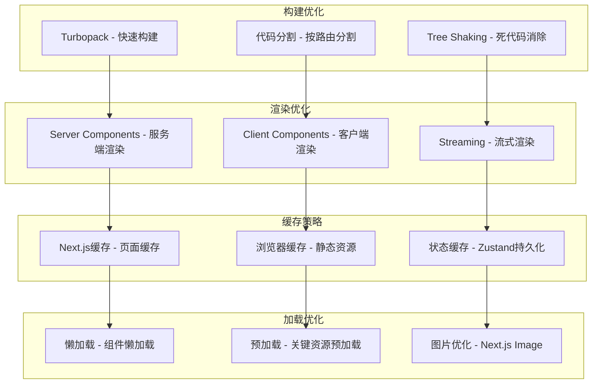

# 🏗️ PeerPortal 前端架构 Mermaid 图表

## 1. 整体分层架构



## 2. Next.js App Router 目录结构



## 3. 技术栈组成架构



## 4. 数据流架构



## 5. 组件架构层级



## 6. 路由架构

```mermaid
graph LR
    subgraph "根路由 /"
        R1[layout.tsx - 全局布局]
        R2[page.tsx - 首页]
    end
    
    subgraph "分组路由 (homepage)"
        H1[page.tsx - 主页内容]
        
        subgraph "认证路由 (auth)"
            A1[layout.tsx - 认证布局]
            A2[login/page.tsx - 登录]
            A3[signup/page.tsx - 注册]
        end
    end
    
    subgraph "功能路由"
        F1[tutor/page.tsx - 导师列表]
        F2[tutor/[id]/page.tsx - 导师详情]
        F3[ai-advisor/page.tsx - AI助手]
        F4[chat/page.tsx - 聊天]
        F5[profile/page.tsx - 用户资料]
        F6[contact/page.tsx - 联系我们]
    end
    
    R1 --> H1
    R1 --> A1
    A1 --> A2
    A1 --> A3
    R1 --> F1
    F1 --> F2
    R1 --> F3
    R1 --> F4
    R1 --> F5
    R1 --> F6
```

## 7. 状态管理架构



## 8. API服务架构



## 9. 性能优化架构



## 📊 架构特点总结

### ✅ 优势
- **现代化**: 使用最新版本的React和Next.js
- **类型安全**: 100% TypeScript覆盖
- **模块化**: 清晰的目录结构和组件分层
- **可维护**: 职责分离，易于扩展
- **性能优化**: 多层次的性能优化策略

### 🎯 设计原则
- **分层架构**: 明确的层级划分
- **组件化**: 可复用的组件设计
- **状态集中**: 统一的状态管理
- **类型安全**: 严格的TypeScript约束
- **用户体验**: 响应式和无障碍设计

### 🚀 技术亮点
- **App Router**: Next.js 13+的新路由系统
- **Server Components**: 服务端组件优化
- **Zustand**: 轻量级状态管理
- **Tailwind CSS**: 原子化CSS框架
- **AI集成**: 完整的AI功能支持
